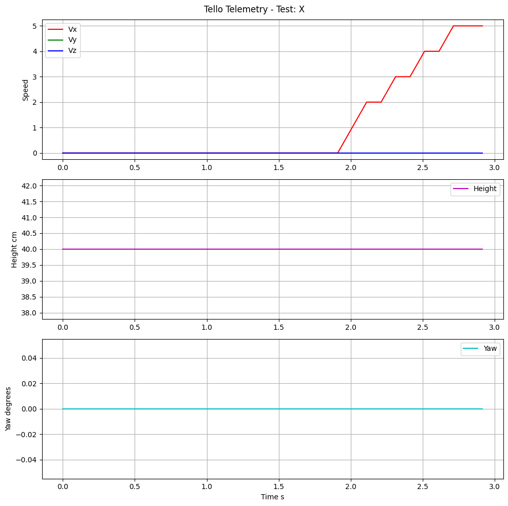
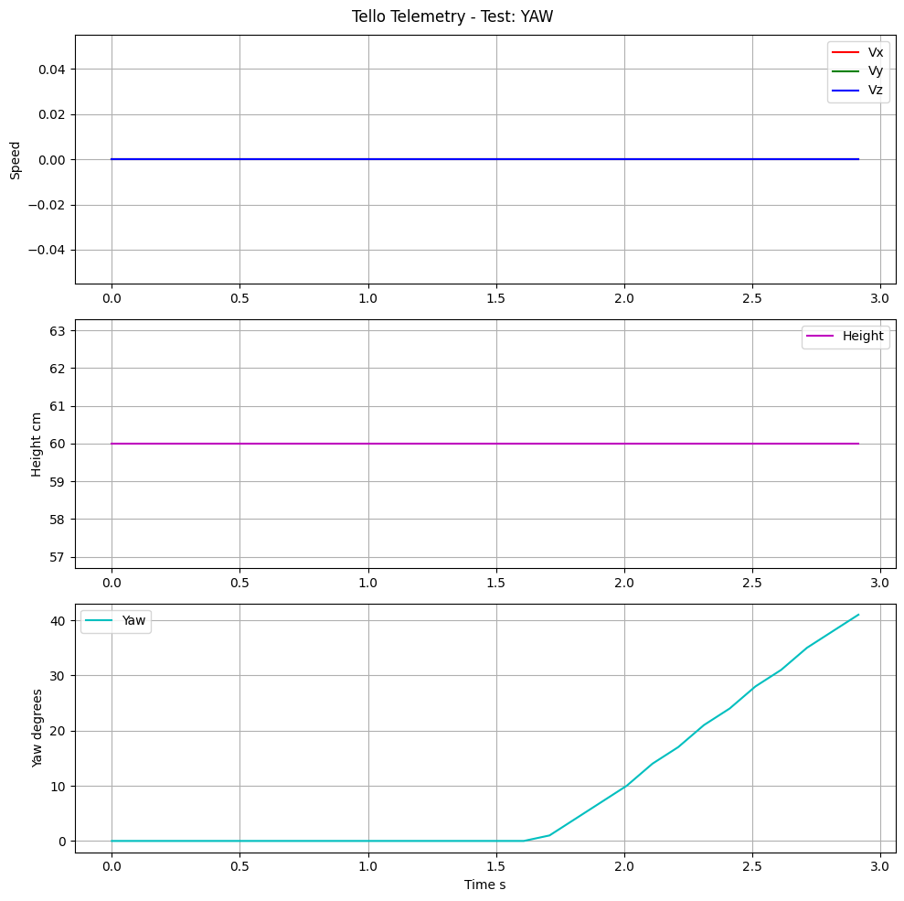
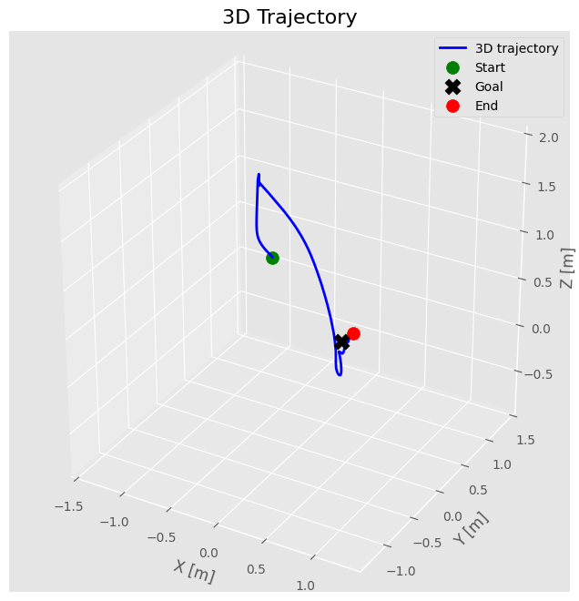
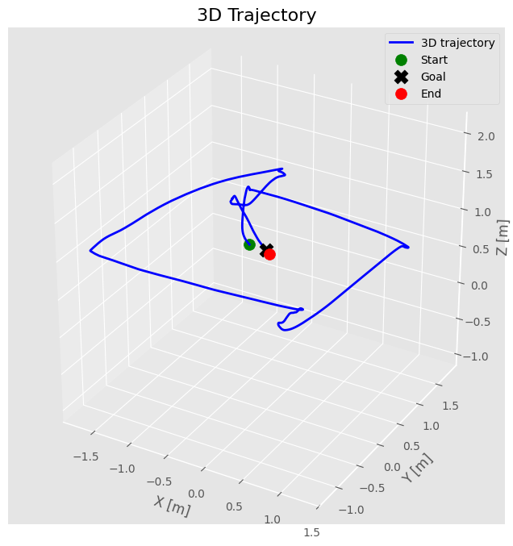
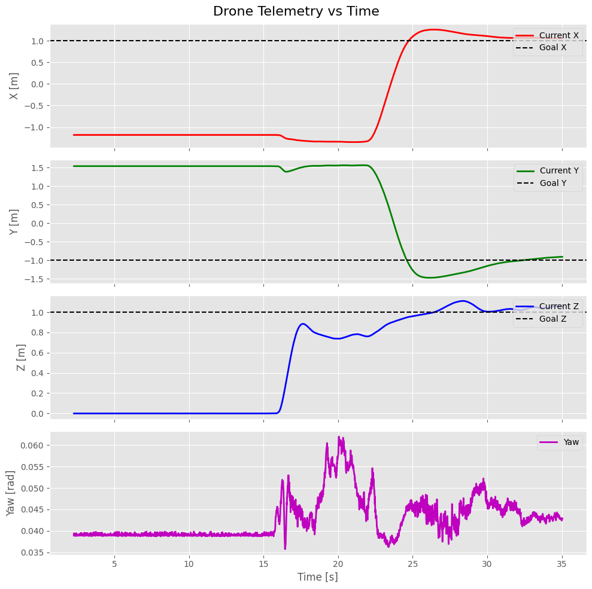
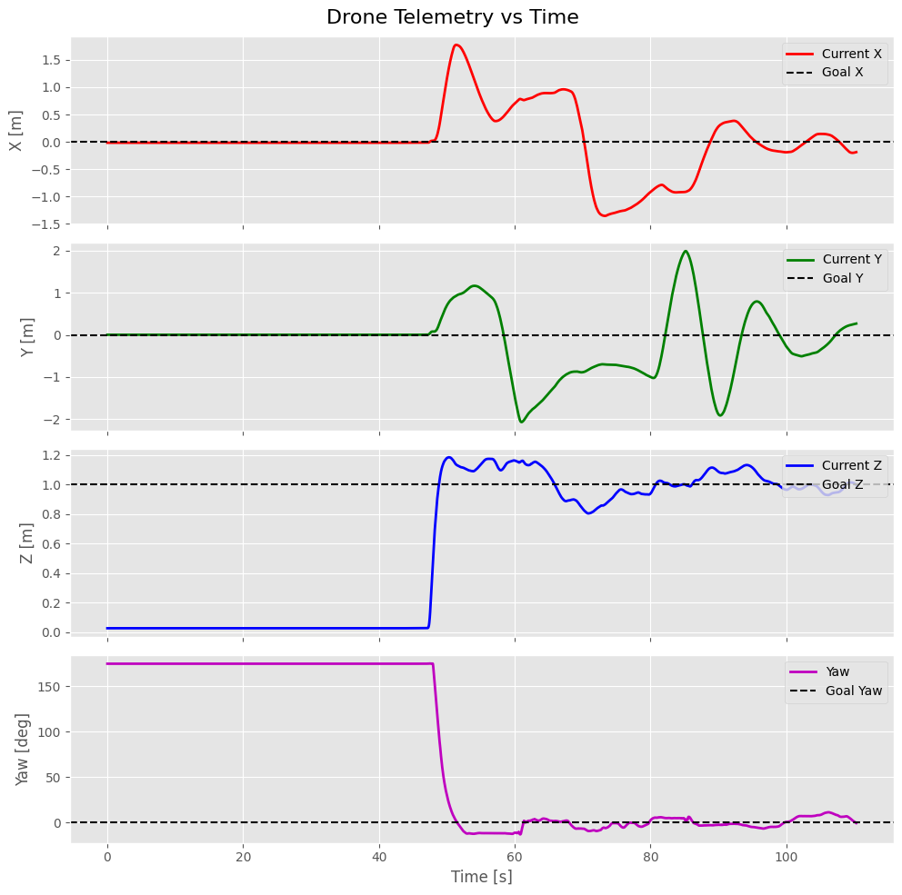

# Tello Drone Control with ROS 2 and OptiTrack

Kinematic position control system for a DJI Tello quadcopter using OptiTrack motion capture feedback in ROS 2.

## Overview

The system runs an outer-loop discrete Proportional-Integral (PI) kinematic controller in ROS 2. The internal Tello firmware already manages high-frequency attitude and motor dynamics. Because the ROS 2 node commands body velocities directly rather than torques or accelerations, a derivative term is unnecessary and would amplify measurement noise. The integral term eliminates steady-state position error caused by battery drop and aerodynamics.

## Installation

### Prerequisites
- Ubuntu 24.04 with ROS 2
- Python dependencies

### Setup
Clone the repository with submodules:
```bash
git clone --recursive https://github.com/mojarras7/Tello-Optitrack.git
cd Tello-Optitrack
```

Install Python dependencies:
```bash
pip install -r requirements.txt
```

Build the ROS 2 workspace:
```bash
colcon build --symlink-install
source install/setup.bash
```

## Network Architecture

The Linux PC connects simultaneously to two separate networks:
- **Ethernet interface (Motive streaming)**: Static IP subnet (e.g. `192.168.1.2` for Linux, `192.168.1.1` for Windows Motive PC). Streaming mode in Motive must be set to **Unicast**.
- **WiFi interface (Tello drone)**: Factory access point on subnet `192.168.10.x`.

> **WARNING**: Never assign the `192.168.10.x` subnet to the Ethernet interface to prevent IP routing conflicts with the drone.

## OptiTrack Motive Setup

When creating the Rigid Body in Motive:
- Any rigid body name can be assigned. The default is `drone` (which publishes to `/drone/pose`). If using a different name, pass it via the `rigid_body_name` parameter.
- Align physical drone axes to the standard ROS FLU frame:
  - **X-axis**: Front of the drone
  - **Y-axis**: Left of the drone
  - **Z-axis**: Up

## How to Run

### 1. Start OptiTrack Stream
```bash
ros2 launch natnet_ros2 natnet_ros2.launch.py
```

### 2. Launching the Drone Nodes
Once the OptiTrack data is streaming, you can run the control system and the graphs together using the launch file. By default, the system listens to the `/drone/pose` topic. 

```bash
ros2 launch tello_control controller_with_plot.launch.py
```

To use a custom rigid body name:
```bash
ros2 launch tello_control controller_with_plot.launch.py rigid_body_name:=my_tello
```

Alternatively, run each node in separate terminals:
```bash
# Run the control node
ros2 run tello_control tello_controller --ros-args -p rigid_body_name:=my_tello

# Run the pose plotter node
ros2 run tello_control pose_plotter --ros-args -p rigid_body_name:=my_tello
```

### 3. Send Target Setpoint
You can send the target position (X, Y, Z) and optionally the target orientation (Yaw in degrees). If you omit the Yaw, the drone defaults to facing forward (0°).

```bash
# Go to X=-1.0, Y=1.0, Z=1.0, facing forward (0°)
./utils/send_goal.sh -1.0 1.0 1.0

# Go to X=1.5, Y=0.0, Z=1.5, facing 90° to the left
./utils/send_goal.sh 1.5 0.0 1.5 90
```

### 4. Running the Square Routine
We have provided an automated square routine that flies the drone through four corners and returns to the center. It uses feedback from the controller to ensure it has reached a point before moving to the next.

To run it, simply execute:
```bash
ros2 run tello_control square_routine
```

To set custom hover time at each waypoint:
```bash
ros2 run tello_control square_routine --ros-args -p wait_time:=3.0
```

When it finishes, the drone will hover at the center `(0, 0, 1)`. You can land the drone at any time by pressing `Ctrl+C` in the terminal running the `tello_controller` node.

## Utilities

| Script | Description |
| --- | --- |
| `utils/connect_wifi.sh` | Connects Linux WiFi to Tello using credentials in `config/tello.conf` |
| `utils/check_status.py` | Verifies WiFi link, battery percentage, and internal temperature |
| `utils/send_goal.sh` | Publishes target coordinates to `/goal` |
| `utils/axis_test.py` | Open-loop diagnostic tool for testing drone axes and generating plots |

### Axis Diagnostics
Test open-loop motor response along individual or combined axes:
```bash
python3 utils/axis_test.py --axis=all --duration=3
```

**Arguments:**
- `--axis`: Axis to test. Options: `x`, `-x`, `y`, `-y`, `z`, `-z`, `yaw`, `-yaw`, `all` (default: `z`). For negative values, use the syntax `--axis=-x`.
- `--duration`: Command hold duration in seconds per axis (default: `3`).

Sample diagnostic plots (remaining axis plots are available in `docs/axis_test_plots/`):

#### X-Axis Diagnostic


#### Yaw Diagnostic


## Control Formulation

### Discrete PI Control Law
The discrete position error $e[k]$ in the inertial frame is:

$$e[k] = P_{target} - P_{current}[k]$$

The commanded inertial velocity vector is:

$$V_{inertial}[k] = K_p e[k] + K_i \sum_{j=0}^{k} e[j] \Delta t$$

For orientation, the angular velocity $\omega_z$ (Yaw command) is computed using a normalized angle error to ensure the drone always rotates via the shortest path:

$$e_{yaw}[k] = \text{arctan2}\left(\sin(\psi_{target} - \psi_{current}[k]), \cos(\psi_{target} - \psi_{current}[k])\right)$$

$$\omega_z[k] = K_{p, yaw} e_{yaw}[k] + K_{i, yaw} \sum_{j=0}^{k} e_{yaw}[j] \Delta t$$

### Inverse Rotation Matrix
Orientation data from OptiTrack is received as quaternions $(q_x, q_y, q_z, q_w)$. This is mathematically converted to Euler angles to extract the drone Yaw angle ($\psi$). 

Since the Tello expects movement commands relative to its own local body frame rather than the global frame, the inertial velocity must be transformed. A 2D inverse rotation matrix around the Z-axis is applied to map global vectors into the drone intrinsic axes:

$$V_{body}[k] = R_z(-\psi) V_{inertial}[k]$$

$$R_z(-\psi) = \begin{bmatrix} \cos(\psi) & \sin(\psi) & 0 \\ -\sin(\psi) & \cos(\psi) & 0 \\ 0 & 0 & 1 \end{bmatrix}$$

### RC Command Mapping
The Tello SDK does not accept direct metric velocity commands ($m/s$). Instead, the computed $V_{body}$ vector is scaled by a constant factor and saturated to the $[-100, 100]$ integer range. These normalized values are then transmitted via the `send_rc_control` function, translating the theoretical velocities into standard RC channel inputs (roll, pitch, throttle).

## Flight Results

Flight test plots are saved automatically to `docs/controller_plots/` upon node shutdown.

### 3D Trajectory for one goal


### 3D Trajectory for square routine


### Telemetry vs Time without orientation control


### Telemetry vs Time with orientation control


### Video Demonstrations

*If the embedded videos below do not render in your browser, the original `.mp4` files are available in the `docs/` folder, or you can [watch them on Google Drive](https://drive.google.com/drive/folders/194AXqyvUE2MH0zK1ZJylbbVfOYRGvFbK?usp=sharing).*

#### Flight Demo 1
<video src="docs/flight-demo.mp4" width="600" controls></video>

#### Flight Demo 2 (Aggressive Tuning)
<video src="docs/flight-demo2.mp4" width="600" controls></video>

> **Note:** In this second test, the proportional gain for the Y-axis (`Kp_y`) was set higher than in the first flight. As a result, the roll response is much more aggressive, causing the drone to briefly touch the safety net.

## Author
Alejandro Mojarras - [mojarrasalejandro@gmail.com](mailto:mojarrasalejandro@gmail.com)

Project developed for the technical advancement and benefit of the **DroneOps** student group at **Tecnológico de Monterrey (ITESM), Campus Guadalajara**.

## License
Apache License 2.0
